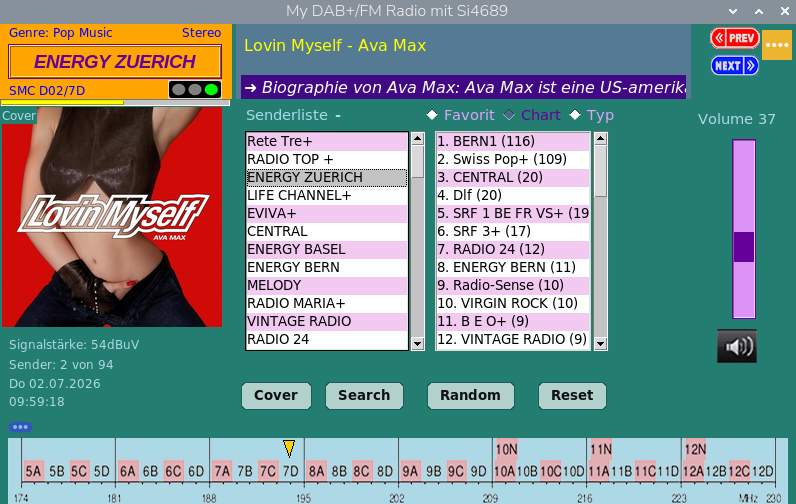
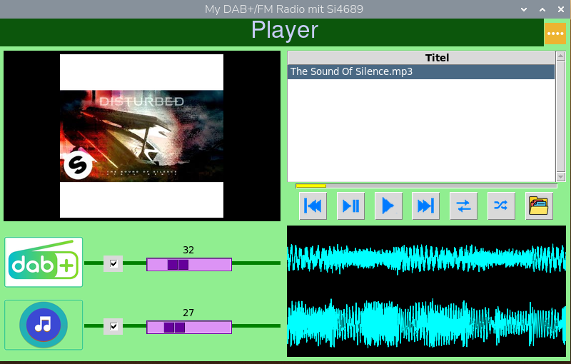
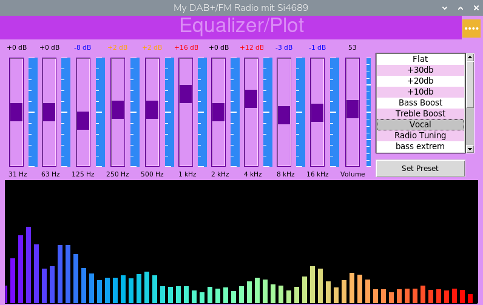
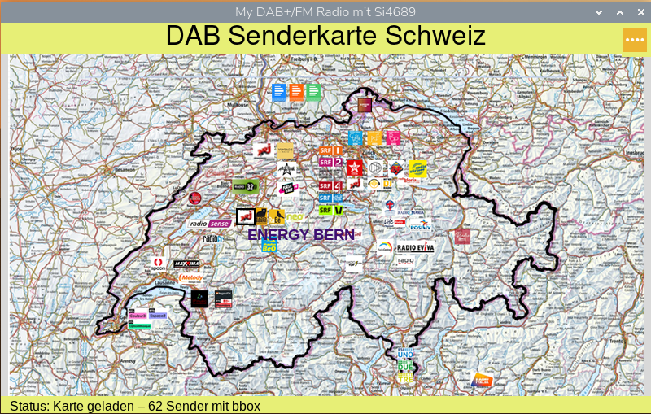
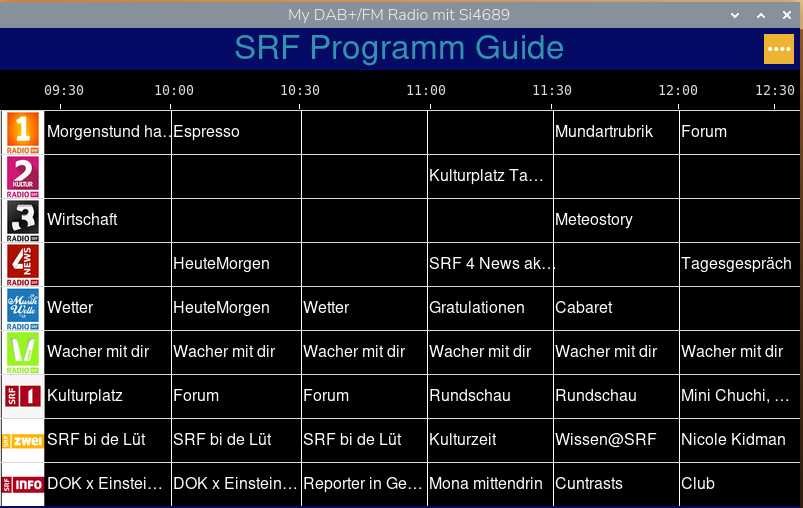
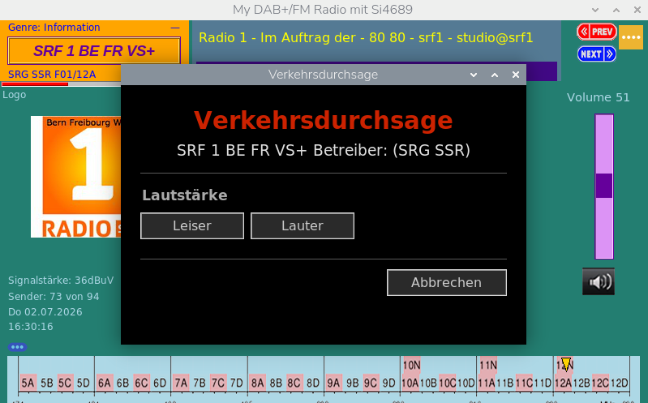
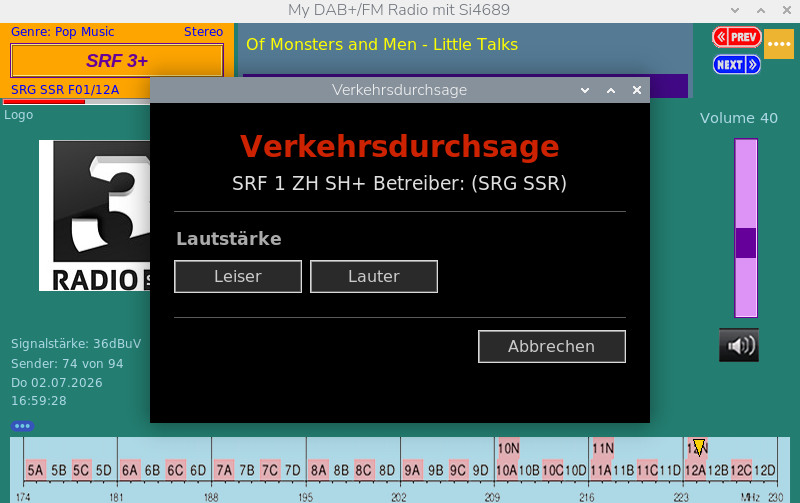
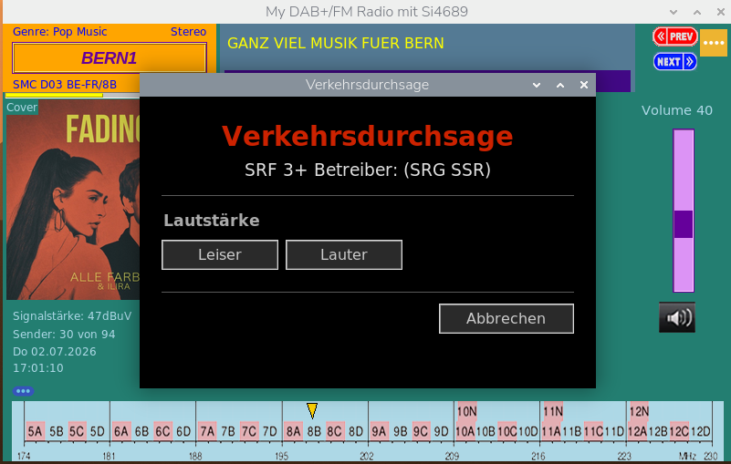

# My_DAB_Si4689

Ein von Grund auf selbst entwickeltes DAB+/FM-Radio für den Raspberry Pi 5, gesteuert über den Skyworks/Silicon Labs **Si4689** DAB-Controller-Chip via SPI. Vollständige Tkinter-GUI mit Live-Traffic-Announcement-Handling, Sender-Datenbank, klickbarer Senderkarte und Schweizer Verkehrsfunk-Integration.

> Nachfolgeprojekt von [`My_DAB_Radio_T5A`](#), das denselben Funktionsumfang auf Basis des Keystone T5A/T4B-Controllers (UART) implementierte. Dieses Projekt ist eine vollständige Migration auf die Si4689-Plattform (SPI statt UART).


*Hauptseite: DAB+/FM-Steuerung mit Cover, Senderliste, Charts, Signalstärke und Band-III-Übersicht*

---

## Warum dieses Projekt?

Es gibt bereits gute Web-UI/CLI-Lösungen für den Si4689 auf dem Raspberry Pi (z. B. das offizielle RaspiAudio-Repo). Dieses Projekt verfolgt einen anderen Ansatz:

- **Native Tkinter-GUI** auf einem angeschlossenen 10.1"-Display statt Web-Interface
- **Vollständiger Traffic-Announcement (TA)-Support** inkl. aller vier empirisch verifizierten Fälle (siehe unten) – dazu findet sich in der öffentlichen Dokumentation praktisch nichts
- **Gelöster GPIO20-Bus-Konflikt** zwischen Si4689 und PCM1863 (HiFiBerry DAC+ADC Pro) – relevant für jeden, der die DAB HAT mit einer aufnahmefähigen Soundkarte kombiniert (siehe unten)
- **Eigene SQLite-Sender-Datenbank** mit Multi-Ensemble-Handling
- **Schweizer Verkehrsfunk-Integration** (DATEX-II/SOAP über opentransportdata.swiss)
- Läuft seit dem 18.06.2026 stabil im Dauerbetrieb auf echter Hardware

---

## Hardware

| Komponente | Beschreibung |
|---|---|
| Raspberry Pi 5 | Hauptplattform |
| RaspiAudio DAB HAT | Si4689-Chip, SPI-Steuerung |
| HifiBerry DAC+ADC Pro HW 1.0.1 | PCM5122 DAC + PCM1863 ADC für Audio-Ausgabe |
| Adafruit MAX98306 | Stereo-Verstärker |
| 10.1" IPS LCD (1280×800, HDMI) | Touch-GUI |

### Pinbelegung (Si4689 / SPI)

| Signal | GPIO (BCM) | Funktion |
|---|---|---|
| MOSI | GPIO10 | SPI Master Out |
| MISO | GPIO9 | SPI Master In |
| SCLK | GPIO11 | SPI Clock |
| CE0 | GPIO8 | SPI Chip Select |
| RST | GPIO25 | Si4689 Reset |
| INT / INTB | GPIO23 | Interrupt (DLS/ANNO-Events) |
| AMP | GPIO17 | Verstärker Enable |

SPI-Takt: 30 MHz.

**Audio-Pipeline:** Si4689 (I2S Slave) → PCM1863 ADC Capture → App → `hifiberry_play_plug` → SoftMaster → systemweiter ALSA-EQ → `dmix` → HifiBerry DAC+ADC Pro → Adafruit MAX98306 (Verstärker). Der 10-Band-EQ (`page_03.py`) wirkt global über `amixer -D equal`, nicht nur auf einen Kanal.

⚠️ **Wichtig:** `GPIO.cleanup()` darf nie aufgerufen werden – es zerstört den Amplifier-Pin-Zustand (GPIO17). Stattdessen schließt `safe_close_spi()` nur den SPI-Filedescriptor.

---

## Software-Architektur

```
My_DAB_Si4689/
├── hardware/
│   ├── si4689_driver.py      # Low-Level SPI-Treiber
│   ├── si4689_init.py        # Si4689Manager: Init & Modus-Wechsel (DAB/FM)
│   └── firmwares/             # rom00_patch, dab_radio, fmhd_radio Binaries
├── utils/
│   └── ta_controller.py      # Traffic-Announcement-Zustandsautomat
├── assets/DB/
│   └── dab_scans.sqlite       # Sender-Datenbank (Tabelle: si4689_datenbank)
├── main.py                    # App-Controller, Dispatcher, Threading
├── main_page.py                # Haupt-GUI-Seite (DataController)
├── page_01.py                  # Statistik: Top-10-Charts (Tag/Woche/Monat/Gesamt), Sender-/Hördauer-Auswertung, Such- und Filterfunktion
├── page_02.py                  # Dual-Channel-Mixer: DAB-Kanal + MP3-Player mit Wellenform-Visualisierung (matplotlib), Seek/Scrub
├── page_03.py                  # Systemweiter 10-Band-ALSA-EQ mit Klangmuster-Presets und Balkendiagramm-Visualisierung
├── page_04.py                  # Sender-Scan / Datenbank
├── page_05.py                  # FM-Radio
├── page_06.py                  # Klickbare Schweizer DAB-Senderkarte
├── page_07.py                  # EPG-Widget mit 6-Programm-Timeline (-90 bis +60 Min, SRF/RTS/RSI)
└── page_08.py                  # Schweizer Verkehrsfunk (opentransportdata.swiss)
```

### Threading-Modell

Alle SPI/Hardware-Aufrufe laufen in einem dedizierten **Dispatcher-Thread**; GUI-Updates kehren über `self.page.after(0, lambda: ...)` in den Tk-Hauptthread zurück. Ein `serial_lock` schützt den exklusiven SPI-Zugriff.

### GUI-Lifecycle

Alle Seiten erben von `BasePage` mit den Lifecycle-Hooks `on_first_activate()` (einmalige Initialisierung) und `on_reactivate()` (bei erneutem Seitenwechsel).

### DAB ↔ FM Umschaltung

Erfordert vollständigen Chip-Reset und Firmware-Neuladen (~5 Sekunden). Dabei müssen `_current_channel`, `_current_sid` und `_current_cid` vor `tune_service()` auf `None` zurückgesetzt werden, sonst überspringt die Channel-Skip-Optimierung `dab_tune()`.

---

## Screenshots

<table>
<tr>
<td width="50%">

**Dual-Channel-Mixer** (`page_02.py`)
Wellenform-Visualisierung (matplotlib) für DAB- und Player-Kanal, unabhängige Lautstärkeregler, MP3-Player mit Cover-Anzeige.



</td>
<td width="50%">

**10-Band-Equalizer** (`page_03.py`)
Systemweiter ALSA-EQ mit Klangmuster-Presets (Flat, Bass Boost, Vocal, Radio Tuning, …) und Live-Balkendiagramm.



</td>
</tr>
<tr>
<td width="50%">

**Schweizer DAB-Senderkarte** (`page_06.py`)
Klickbare Karte mit über 60 Sendern inkl. Logos und Bounding-Box-Filterung.



</td>
<td width="50%">

**EPG-Widget** (`page_07.py`)
6-Programm-Timeline (−90 bis +60 Min) für SRF-Radioprogramme.



</td>
</tr>
</table>

---

## Highlight: Traffic-Announcement (TA)-Handling

Der Si4689 ist **WorldDMB Profile 1** und liefert keine OE-Announcements (FIG 0/25/0/26). Stattdessen liefert `0xB6` (`DAB_GET_ANNOUNCEMENT_INFO`) zur Laufzeit den Ziel-Carrier (SID/CID) — vorausgesetzt, man liest ihn **nur**, wenn das `anno`-Flag oder das `annoint`-Sticky-Bit aktiv ist (blinde Reads liefern ERR oder Phantom-Daten).

Auf echter Hardware wurden vier Fälle empirisch verifiziert:

**Fall (b):** aktueller Sender und TA-Zielsender sind identisch (SRF 1 BE FR VS+, kein Wechsel möglich/nötig)



**Fall (c):** aktueller Sender und TA-Zielsender unterscheiden sich, liegen aber im selben Ensemble (aktuell SRF 3+, Ziel SRF 1 ZH SH+, beide im Ensemble SRG SSR F01/12A) → Wechsel via `dab_start_service`



**Fall (d):** aktueller Sender und TA-Zielsender liegen in unterschiedlichen Ensembles (aktuell BERN1 im Ensemble SMC D03 BE-FR/8B, Ziel-SID in einem anderen Ensemble/Kanal) → Hinweisfenster, kein automatisches Umschalten



```
[TA] Fall (d) erkannt – Cross-Channel-Ziel 0x43B3
     auf Kanal 12A (aktuell 8B), kein Umschalten.
[TA] Durchsage aktiv – Fenster + TA-Lautstärke.
[TA] zurück auf Heimsender (BERN1).
```

| Fall | Beschreibung | Verhalten |
|---|---|---|
| **(a)** | Angesagt, aber ohne ANNO-Flag | nicht erkennbar / kein Trigger |
| **(b)** | ANNO-Ziel = aktueller Sender | kein Wechsel nötig — bestätigt (siehe Screenshot oben) |
| **(c)** | ANNO-Ziel im selben Ensemble, anderer Sender | Wechsel via `dab_start_service` — bestätigt (siehe Screenshot oben) |
| **(d)** | ANNO-Ziel in anderem Ensemble/Kanal (Cross-Channel) | Hinweisfenster, kein automatischer Wechsel — bestätigt (siehe Screenshot oben) |

**Bekannter Bug & Fix:** Bei einer SID, die in mehreren Ensembles vorkommt (z. B. SRF 3+ gleichzeitig in Kanal 12A und 12C), wurde Fall (d) fälschlich erkannt. Die Lösung: `_ta_target_info` lädt alle DB-Zeilen für die SID und bevorzugt die Zeile, die zum aktuellen `_current_channel` passt, statt einfach die erste Treffer-Zeile zu nehmen.

**Architekturhinweis:** Die GPIO23-Interrupt-Architektur wird für DLS- und ANNO-Events genutzt. Zusätzlich läuft ein 1-Hz-Polling für TA, weil die offene Drain-INT-Leitung des Si4689 durch kontinuierliche DSRVINT/DLS-Pakete tief gehalten wird und dadurch ANNO-Flankenwechsel maskieren kann.

`dab_start_service` erfordert vorher eine FIC-Qualität ≥ 90 % (aktiv abfragen) sowie `stc_ack=True`, um ein anstehendes STCINT zu quittieren.

---

## Highlight: GPIO20-Bus-Konflikt (Si4689 + PCM1863) lösen

Ein Problem, das vermutlich jeden trifft, der die RaspiAudio DAB HAT mit einer **aufnahmefähigen** Soundkarte (wie der HiFiBerry DAC+ADC Pro) kombiniert – aber nirgends dokumentiert ist. Diese Lösung hat uns erheblichen Zeit- und Testaufwand gekostet.

**Das Problem:** Der Si4689 gibt sein I2S-Audiosignal auf `DOUT` aus, das mit **GPIO20** verdrahtet ist. Der PCM1863-ADC auf der HiFiBerry-Karte treibt seinen eigenen I2S-`DOUT` **ebenfalls** auf GPIO20. Beide Chips senden gleichzeitig auf derselben Leitung – ein klassischer Bus-Konflikt, der sich als permanente Audio-Verzerrung äussert.

**Was nicht funktioniert hat:**
- PCM1863 per ALSA-Mixer stummschalten (`amixer sset "ADC Left Input" "No Select"`, Lautstärke auf 0) reduziert die Störung, verhindert aber nicht, dass der Chip elektrisch weiter auf GPIO20 sendet – nur eben Nullen statt Nutzdaten. Der Bus-Konflikt bleibt bestehen.
- Direktes Schreiben ins Power-Down-Register per `i2cset` schlägt fehl, da der Kernel-Treiber das I2C-Gerät exklusiv sperrt (`i2cdetect` zeigt `UU`): `Error: Could not set address to 0x4a: Device or resource busy`
- Kernel-Modul entladen (`modprobe -r`) reisst die komplette HiFiBerry-ALSA-Karte ab, inklusive DAC-Ausgang – keine Option im laufenden Betrieb.
- Das ASoC-Debugfs-Interface (`codec_reg`), das normalerweise direkten Registerzugriff erlaubt, ist für diesen Codec im aktuellen Raspberry Pi OS-Kernel nicht verfügbar.

**Die Lösung:** `smbus2` mit `force=True` nutzt den `I2C_SLAVE_FORCE`-ioctl statt `I2C_SLAVE` und umgeht damit die exklusive Kernel-Sperre – ganz ohne Treiber zu entladen oder die ALSA-Karte zu stören:

```python
import smbus2
bus = smbus2.SMBus(1, force=True)
bus.write_byte_data(0x4A, 0x70, 0x01)  # PCM1863 Power-Down → DOUT Hi-Z
bus.close()
```

Register `0x70` (Power-Down Control, PWRDN-Bit) versetzt den PCM1863 in Power-Down – `DOUT` geht in den hochohmigen Zustand (Hi-Z), der Si4689 treibt GPIO20 unangefochten, die Verzerrung verschwindet vollständig.

**Wichtig:** Dieser Aufruf muss **zweimal** erfolgen – einmal beim Programmstart, und ein zweites Mal **ca. 500 ms nach dem Öffnen des ALSA-Capture-Streams**, da das ASoC-DAPM-Framework den Codec beim Stream-Open wieder hochfährt und das Register zurücksetzt (siehe `_unmute_adc()`/`_pcm186x_dout_disable()`-Aufrufe in `audio_codec_hifiberry.py`).

**Verifikation:**
```python
bus = smbus2.SMBus(1, force=True)
val = bus.read_byte_data(0x4A, 0x70)
print("Hi-Z" if val & 1 else "DOUT still active")
bus.close()
```

Diese Erkenntnis wurde auch als Feedback an das RaspiAudio-Entwicklerteam gemeldet, in der Hoffnung, dass sie zukünftigen Nutzern der DAB HAT mit aufnahmefähigen Soundkarten hilft.

---

## Weitere technische Erkenntnisse

- RSSI-Werte des Treibers sind **dBµV**, nicht dBm. Audio-Soft-Mute unterhalb von ca. 38 dBµV wird durch ACF-Soft-Mute auf dem MSC-Audio-BER verursacht, nicht durch den RSSI-Schwellenwert. 100 % FIC-Qualität garantiert keine hörbare Audioausgabe.
- SQLite-Pfade müssen immer absolut angegeben werden – sonst legt SQLite stillschweigend eine neue leere DB im aktuellen Arbeitsverzeichnis an.
- `is_ready` in `Si4689Manager` ist eine Read-only-Property; für direkte Zustandsmanipulation `vars(si)["_initialized"]` verwenden.

---

## Software-Stack

- Python 3.14 (venv: `my_venv_314`, ausgeführt als `sudo`)
- Tkinter (GUI)
- SQLite (Sender-Datenbank, Statistik)
- RPi.GPIO über `rpi-lgpio`
- ALSA mit `dmix`, `dsnoop`, LADSPA `plugequal` (systemweiter 10-Band-EQ, gesteuert über `amixer -D equal`), `softvol SoftMaster`
- matplotlib (Wellenform- und Balkendiagramm-Visualisierung, TkAgg-Backend)
- numpy (Audio-Signalverarbeitung für Visualisierungen)
- mutagen (MP3-ID3-Tags, Cover-Art für den Player)
- Pillow (PIL, Bild-Assets in der GUI)

## Konfiguration

Das EPG-Widget (`page_07.py`) und der Schweizer Verkehrsfunk (`page_08.py`) benötigen Zugangsdaten für die [opentransportdata.swiss](https://opentransportdata.swiss/de/)-API. Diese liegen **nicht** im Repository (Secrets).

```bash
cp assets/epg_config.example.py assets/epg_config.py
```

Anschliessend in `assets/epg_config.py` die eigenen Werte eintragen (`EPG_CLIENT_ID`, `EPG_CLIENT_SECRET`, `API_TOKEN`). Zugangsdaten können kostenlos unter opentransportdata.swiss beantragt werden.

## Installation

```bash
git clone https://github.com/weilmy/My_DAB_Si4689.git
cd My_DAB_Si4689

python3 -m venv ~/my_venv_314
source ~/my_venv_314/bin/activate
pip install -r requirements.txt

sudo ~/my_venv_314/bin/python3 main.py
```

**requirements.txt**

```
feedparser==6.0.12
matplotlib==3.10.7
mutagen==1.47.0
numpy==2.4.4
Pillow==12.0.0
psutil==7.2.2
Pyphen==0.17.2
requests==2.33.1
RPi.GPIO==0.7.1
rpi-lgpio==0.6
smbus2==0.6.1
spidev==3.8
tabulate==0.10.0
```

> ⚠️ Firmware-Dateien (`rom00_patch*.bin`, `dab_radio_*.bin`, `fmhd_radio_*.bin`) sind **proprietäre Skyworks-Software** und **nicht** in diesem Repository enthalten – die Redistribution durch Dritte ist nicht gestattet. Bezugsquelle: das offizielle [RaspiAudio-Repo](https://github.com/RASPIAUDIOadmin/Digital-Radio-for-Raspberry-Pi) (Hersteller des DAB HAT), Ordner `firmwares/`.

## Referenzen

- [Si468x Programming Guide (AN649)](https://www.skyworksinc.com)
- ETSI EN 300 401 (DAB-Standard)
- [opentransportdata.swiss API](https://opentransportdata.swiss/) (Schweizer Verkehrsfunk)

## Lizenz

MIT License – siehe [LICENSE](LICENSE).

## Status

Feature-vollständig, im stabilen Dauerbetrieb auf echter Hardware seit dem 18.06.2026. Aktuell in der Beobachtungsphase (keine weiteren Features geplant, Fokus auf Verifikation von TA-Edge-Cases im Live-Betrieb).
